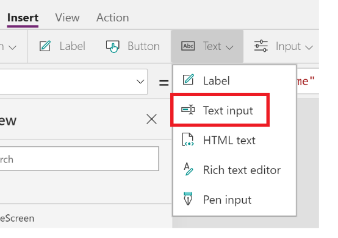
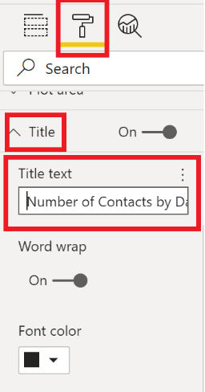

##  Introduction

The vision for the Power Platform started from the recognition that data is increasingly flowing from everything, and a belief that organizations that harness their data – to gain insights then used to drive intelligent business processes – will outperform those that don’t.
</br>
</br>
</br>
</br>
The Power Platform enables power users with an integrated and cohesive low-code toolset
</br>
</br>
</br>
* **Power Apps:** a low-code approach to building apps

    * Easily build web & mobile apps with a full featured low-code / no-code platform 
    
* **Power BI:** a low-code approach to analytics

    * A business analytics solution that lets you visualize your data and share insights across your organization, or embed them in your app or website.
    
* **Power Automate:** a low-code approach to automation

    * Model business processes and automate workflows and your apps and services
    
* **Power Virtual Agents:** a low-code approach to chatbots

    * Create powerful chatbots—without the need for developers or data scientists—by using a guided, no-code graphical interface.
    
* **Common Data Service (CDS):** low code backend & database

    * More than a database ->  “out-of-the-box” backend for apps

    * A fully managed, secure, database, that has Microsoft data from Dynamics 365, Office 365 and Azure pre-populated.
    
* **Data Connectors:** built-in connectivity

    * Built-in connectivity to 250+ cloud services, content services, databases, APIs, etc.

* **AI Builder:** no code AI for apps and processes

    * Low code AI solutions for Power Platform leveraging the power of Microsoft AI

    * Four Major AI Models out of the box
    
        * **Binary classification:** predict fields such as churn and renewal.
        
        * **Forms processing:** most commonly used model allowing invoice and other document processing
        
        * **Object detection:** build smart camera controls that can be trained to recognize and classify objects
        
        * **Text classification:** tag and categorize survey data, notes to extract patterns and insights


## Situation

During networking events, I would like to be able to take a picture of a business card to automatically create a contact in Outlook. I would then like to have a Power BI dashboard to visualize how many new connections I’ve made by month.
</br>
</br>

##  Overview Diagram for the Demo
</br>


</br>

##  Task 1: Create Power App
1.	Navigate to [Power Apps](https://powerapps.com/)

2.	Click “Sign in” in the top right

3.	Ensure you are in the “Microsoft (new default)” environment
</br>

4.	Under “AI Builder”, click “build”
</br>

**Note:** You may need to start your AI Builder Trial on the purple ribbon on top

6.	Click “Business Card Reader”
</br>

7.	Click “Create App”

8.	Under “Blank App”, click “Phone Layout”
</br>


</br>

##  Task 2: Customize App

1.	Rename “Screen1”

    a.	Right click “Screen1” -> “Rename”
    
    b.	Type “HomeScreen”
    
2.	Add a new Screen

    a.	Under “Home”, click “New Screen” -> “Blank”
    </br>

3.	Rename “Screen2”

    a.	Right click “Screen2” -> “Rename”

    b.	Type “BusCardReader”

4.	Customize “HomeScreen”

    a.	Click “HomeScreen”

    b.	Under “Home” -> Click “Fill” and select background color
    </br>

5.	Insert app title label to HomeScreen

    a.	Under “Insert” -> Click “Label”
    </br>

    b.	Right click “Label1” -> “Rename” -> Type “Title”
    
    c.	On the “Properties” right sidebar, under “Text”, replace “Text” with the title of your app
    </br>

    d.	On the same sidebar, customize the color, size, position and font of your label

6.	Insert navigation button to HomeScreen

    a.	Under “Insert” -> Click “button”
    </br>
    
    b.	Right click “Button1” -> “Rename” -> Type “NavigateToBusCardReader”
    
    c.	On the “Properties” right sidebar, under “Text”, replace “Button” with “EnterApp”
    
    d.	On the same sidebar, customize the color, size, position and font of your button
    
    e.	On the “Advanced” right sidebar, under “OnSelect”, replace “false” with:
    
    *Navigate(BusCardReader)*
    
    </br>

</br>
Your HomeScreen should now look like this:
</br>

7.	Add AI Builder functionality

    a.	Under “Insert” -> Click “AI Builder” -> Click Business card reader
    </br>
    
    b.	Customize the size and location of the scanner. 
    
    **Suggestion:** Width should take up the whole screen width and height should be 25% of the total screen height.
    
8.	Retrieve First Name from Business Card Reader

    a.	Under “Insert” -> Click “Label”

    b.	Right click “Label2” -> “Rename” -> Type “FirstName”

    c.	On the “Properties” right sidebar, under “Text”, replace “Text” with “First Name”

    d.	On the same sidebar, customize the color, size, position and font of your label

    e.	Under “Insert” -> Click “Text” -> “Text Input”
    </br>
    
    f.	Right click “TextInput1” -> “Rename” -> Type “FirstName1”. 
    
    **Note:** The underscore is needed because items must have a unique name within your app.
    
    g.	On the “Advanced” right sidebar, under “Data” ->“Default”, replace “Text input” with:
    
    *BusinessCardReader1.FirstName*
    
    </br>
    
    h.	On the same sidebar, under “Properties”, customize the color, size, position and font of your label

**Repeat** Step 8 for "Last Name", "Company", "Job Title", "Phone Number" and "Email". Use the following formulas:
* BusinessCardReader1.LastName

* BusinessCardReader1.CompanyName

* BusinessCardReader1.JobTitle

* BusinessCardReader1.MobilePhone

* BusinessCardReader1.Email

9.	Add Create Contact Button

    a.	Under “Insert” -> Click “button”
    
    b.	Right click “Button2” -> “Rename” -> Type “CreateContact”
    
    c.	On the “Properties” right sidebar, under “Text”, replace “Button” with “Create Contact”
    
    d.	On the same sidebar, customize the color, size, position and font of your button
    
</br>
Your HomeScreen should now look like this:
</br>


</br>

##  Task 3: Create Azure SQL Database

**Note:** If you do not have an Azure Subscription, navigate to: [MSDN](https://my.visualstudio.com/) -> Under “Azure” -> Click “Activate and follow the instructions"
</br>

1.	Navigate to portal.azure.com

2.	Search “azure SQL” in the navigation bar and click “Azure SQL”
</br>

3.	Click “+ Add”
</br>

4.	Under “SQL databases”, select “Single database” and click “Create”
</br>

    a.	Under “Resource group” -> “Create New” -> Enter a name for your resource group

    b.	Under “Database name” -> Enter a name for your database

    c.	Under “Server” -> “Create New” 

        i.   Under “Server Name” -> Enter a unique name for your server

        ii.  Under “Server Admin Login” -> Create a username for your server

        iii. Under “Password” -> Create a password for your server

        iv.  Under “Location” -> Canada Central

        v.   Click OK

    d.	Under “Want to use SQL elastic pool” -> Select No

    e.	Under “Compute + Storage” -> Select “Configure Database” -> Select Basic” -> Click Apply
    </br>
    
    f.	Click “Review + Create”
    
    g.	Click “Create”

</br>
Deployment may take a few minutes.
</br>
</br>

5.	Click “Go to Resource”

6.	On the left navigation bar, click “Query editor”
</br>

7.	Login to your database by using SQL Server Authentication and by using the username and password you just created for your server

8.	If an error appears, copy the IP Address (in this case “167.220.148.75”) and click “Set Server Firewall”
</br>

    a.	Under “Allow Azure services and resources to access this server” -> Click “On”
    
    b.	Under Rule Name -> “Rule1”
    
    c.	Under Start IP -> Paste the IP Address you copied
    
    d.	Under End IP -> Paste the IP Address you copied
    </br>
    
    e.	Click “Save”
    
    f.	Click the “X” in the top right to return to the query editor
    </br>
    
9.	Attempt to login again using the same method as step 7

10.	Paste the following SQL script and click “Run”:
    ```sql
    CREATE TABLE ContactTable (
        FirstName varchar(255),
        LastName varchar(255),
        JobTitle varchar(255),
        Company varchar(255),
        PhoneNumber varchar(255),
        Email varchar(255),
        Day varchar(255),
        Month varchar(255),
        Year varchar(255)
    );
    GO

    ```


</br>

##  Task 4: Create Power Automate Flow

1.	Return to your Power App

2.	Click your “Create Contact” button

3.	Under “Action” -> Click “Power Automate”
</br>

4.	Click “+ Create a new flow”

5.	Ensure you are in the “Microsoft (new default)” environment
</br>

6.	Click “PowerApps button”
</br>

7.	Change the flow name

    a.	Double-click “PowerApps button” and replace with “CreateContact”
    </br>
    
8.	Click “+ New step”

9.	Search “sql server” ->  select “Insert row (V2)”

    a.	Under “Authentication Type” -> “SQL Server Authentication”

    b.	Under SQL Server Name -> Retrieve the server name that you created in Step 4. On the Azure portal, navigate to your SQL Database. 
    </br>
    
    c.	Under “SQL database name” -> Type the name of the database you created
    
    d.	Under “Username” and “Password” -> Type the login information you used to setup your SQL server
    
    e.	Leave “Gateway” blank
    
    f.	Click “Create”
    
10.	Under “Server Name” and “Database Name” -> Choose the option to “Use Connection Settings (xxxxx.database.windows.net)”

11.	Under “Table Name” -> Select “ContactTable”

12.	You should see the fields of your table appear (e.g. FirstName, LastName, JobTitle, etc.)

    a.	Under “FirstName” -> Click “Ask in PowerApps”. A purple box should appear in the field.

    b.	Repeat step a for the rest of the fields. 
    
        **Note:** You will need to press “See more”, in order for the “Ask in PowerApps” option to appear.
        
    
    
    c.	Under “SQL database name” -> Type the name of the database you created
    
    d.	Under “Username” and “Password” -> Type the login information you used to setup your SQL server
    
    e.	Leave “Gateway” blank
    
    f.	Click “Create”
    
10.	Under “Server Name” and “Database Name” -> Choose the option to “Use Connection Settings (xxxxx.database.windows.net)”

11.	Under “Table Name” -> Select “ContactTable”

12.	You should see the fields of your table appear (e.g. FirstName, LastName, JobTitle, etc.)

    a.	Under “FirstName” -> Click “Ask in PowerApps”. A purple box should appear in the field.

    b.	Repeat step a for the rest of the fields. 
        
        **Note:** You will need to press “See more”, in order for the “Ask in PowerApps” option to appear.
        
        
        
    c.	Click “Save”
    
13.	Click “+ New Step”

14.	Search for “outlook” and select “Create contact (V2)”

    a.	Click “Show advanced options” 
    </br>

    b.	Under “Folder id” -> choose “Contacts”
    
    c.	Under “Given name” -> Choose “Insertrow(V2)_FirstName”
    
    d.	Under “Home phones Item – 1” -> Choose” Insertrow(V2)_PhoneNumber”
    
    e.	Under “Email addresses address - 1” -> Choose” Insertrow(V2)_Email”
    
    f.	Under “Company name” -> Choose” Insertrow(V2)_Company”
    
    g.	Under “Surname” -> Choose” Insertrow(V2)_LastName”

    h.	Under “JobTitle” -> Choose” Insertrow(V2)_JobTitle”
    
    i.	Click “Save”


</br>

##  Task 5: Attach Power Automate Flow to your App

1.	Navigate back to your Power App

2.	You should now see your newly created Power Automate Flow in your list. Click “CreateContact”
</br>

3.	You should now see the following appear on the function bar:
</br>

4.	Replace “CreateContact.Run(“ with the following statement:

`CreateContact.Run(FirstName1.Text,LastName1.Text,JobTitle1.Text,Company1.Text,PhoneNumber1.Text,Email1.Text,Text( Today(), "[$-en-US]dd" ),Text( Today(), "[$-en-US]mm" ),Text( Today(), "[$-en-US]yyyy" ))`

5.	Under “File” -> Click “Save as” -> Click “The cloud – Save to Power Apps” -> Give your app a name
</br>

6.	Under “File” -> Click “Save” -> Click “Publish”
</br>


</br>

##  Task 6: Create Power BI Dashboard

1.	Open Power BI Desktop

    **Note:** If you do not already have this installed, you can do so here: [Power BI](https://powerbi.microsoft.com/en-us/downloads/) 

2.	Click “Get data”

3.	Search “azure sql” -> Select “Azure SQL database”
</br>

4.	Click “Connect”

5.	Under “Server” -> Type the same server name you found in step 5 - #9.

6.	Under “Database (optional)” -> Leave blank

7.	Under “Data Connectivity Mode” -> Choose “DirectQuery”

8.	Choose “Database” on the left and enter your SQL server credentials
</br>

9.	Click “Connect”

10.	Click the arrow next to your database name
</br>

11.	Tick “ContactTable”
</br>

12.	Click “Load”

13.	You should now see your database fields on the right
</br>

14.	Select the “Stacked column chart” visualization
</br>   

15.	Select and drag fields until you have the following configuration

    a.	Drag “Year”, “Month” and “Day” fields under “Axis”

    b.	Drag the “FirstName” field under “Value”. This should change to “Count of FirstName”
    </br>   

16.	Resize the graph to your liking

17.	Under “Format” -> Under “Title” -> Change to “Contacts by Company”
</br> 

18.	Select “Click to turn Drill down”
</br> 

19.	Select the “Pie chart” visualization
</br>

20.	Select and drag fields until you have the following configuration

    a.	Drag the “Company” field under “Legend”

    b.	Drag the “FirstName” field under “Value”. This should change to “Count of FirstName”
    </br>

21.	Under “Format” -> Under “Title” -> Change to “Contacts by Company”

22.	Resize the graph to your liking

23.	Save your Power BI Dashboard

**Note:** You can refresh the data in your dashboard by click “Refresh”
</br>
</br>

##  Resources

* [Business Card Reader in Power Apps](https://docs.microsoft.com/en-us/ai-builder/business-card-reader-component-in-powerapps) 

* [Microsoft Learn](https://docs.microsoft.com/en-us/learn/powerplatform/) 


